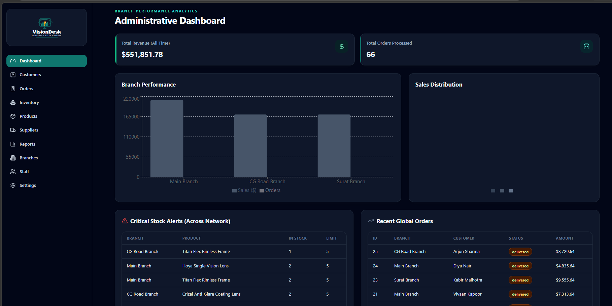
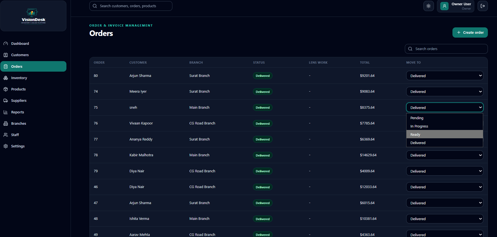
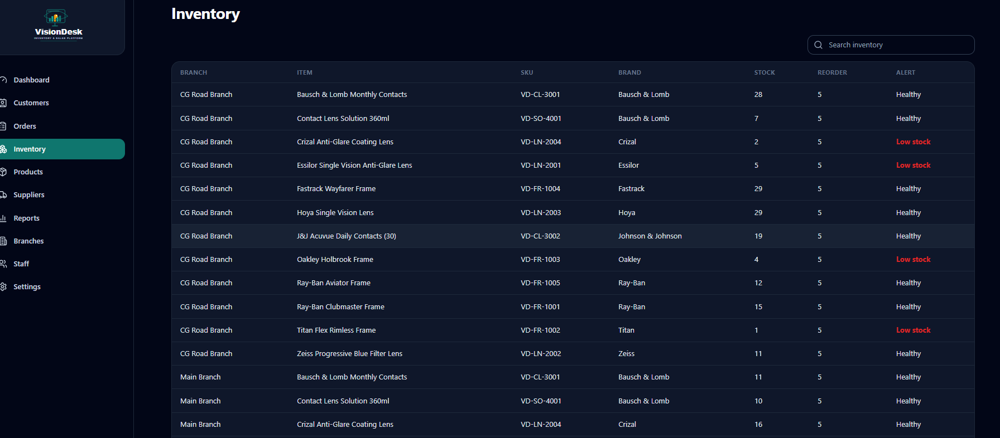
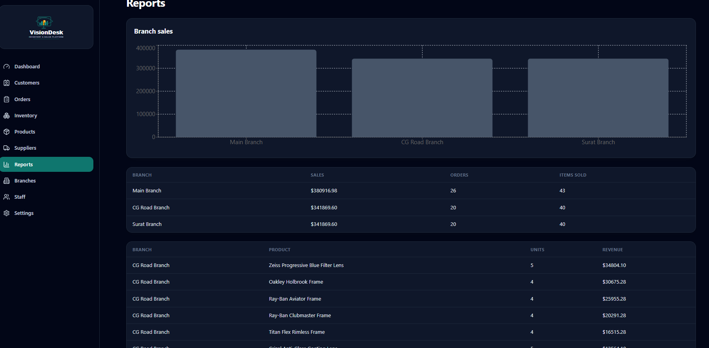

<!-- ==================== PROJECT NAME + DESCRIPTION ==================== -->

# VisionDesk

**Multi-branch operations software for an optical retail chain** — point-of-sale with eye-test prescriptions, GST invoicing, per-branch inventory, a tiered loyalty program, and owner-level cross-branch dashboards and reports.

<!-- ============================ BADGES ============================ -->


</div>

---

<!-- ============================ DEMO ============================ -->

## 🎬 Demo

🔗 **[Live Demo → visiondeskcrm.netlify.app](https://visiondeskcrm.netlify.app)**

🧑‍💻 Log in with `owner` / `owner123` &nbsp;·&nbsp; login is a **`login_id`**, not an email.

| Role | Login | Password |
|---|---|---|
| Owner | `owner` | `owner123` |
| Branch admin | `branchadmin` | `admin123` |
| Staff | `staff` | `staff123` |

---

<!-- ============================ FEATURES ============================ -->

## ✨ Features

The parts I'd walk an interviewer through:

- **🔒 Multi-tenant isolation by construction.** Three roles — `owner`, `branch_admin`, `staff`. A single `branchScope(user)` helper returns `null` for owners and the user's `branch_id` for everyone else, and every branch-owned query is filtered by it. `canAccessBranch()` guards writes, so a non-owner physically cannot create an order or read stock for a branch that isn't theirs — cross-branch access returns `403`, never a silent leak. ([roles.js](backend/src/utils/roles.js), covered by [roles.test.js](backend/src/utils/roles.test.js).)
- **⚛️ The whole sale is one atomic transaction.** [`createOrder`](backend/src/controllers/orderController.js) opens a single `BEGIN`/`COMMIT` that writes the eye-test prescription, the sales order, the GST invoice, every line item, **decrements inventory**, and **appends a stock-ledger row** — all or nothing. Any failure `ROLLBACK`s the lot, so stock can never drift out of sync with what was billed.
- **🧾 GST-correct invoicing.** Tax is computed server-side and split into equal **CGST + SGST** halves (the intra-state GST model), stored per-invoice and per-line with the HSN code, and re-exportable as a PDF via jsPDF — the numbers on screen are the numbers in the database, not a frontend guess.
- **🏅 Loyalty as a state machine in the database.** Paying an invoice ([`invoiceController`](backend/src/controllers/invoiceController.js)) earns and/or redeems points transactionally, then calls the `sp_update_loyalty_tier` **stored procedure**, which recomputes `silver → gold → platinum` from net points. Point value and earn ratio live in a `settings` table, so the business rules are config, not hard-coded constants.
- **🚫 Guarded against double-payment.** An already-`paid` invoice returns `409 Conflict` instead of stacking a second payment and double-awarding loyalty points — the check and the update are inside the same transaction, so there's no race between them.
- **🧷 Defense in depth on every request.** `helmet` headers, a custom in-memory **rate limiter**, **Zod** schema validation at the edge, JWT auth that re-checks the user is still active on every call, and an **audit-log** middleware that records mutating actions with actor, IP, and before/after JSON.
- **🗄️ Idempotent, migration-style schema.** [`schema.sql`](database/schema.sql) is safe to re-run: `IF NOT EXISTS` guards, additive `ALTER TABLE`s, enum back-fills, and trigram (`pg_trgm`) indexes for fuzzy customer/product search — one file bootstraps a fresh database *or* upgrades an existing one.

**Also:** raw parameterized SQL (no ORM, no injection surface), `bcryptjs` password hashing, a forced-password-change flow for admin-provisioned accounts, and consistent `ApiError` → JSON responses with meaningful status codes.

---

<!-- ============================ SCREENSHOTS ============================ -->

## 📸 Screenshots

| Owner dashboard — cross-branch KPIs + charts | Point of sale — order, prescription, GST invoice |
|:---:|:---:|
|  |  |
| **Inventory** — per-branch stock, reorder alerts, transfers | **Reports** — sales/inventory with PDF export |
|  |  |

---

<!-- ======================= ARCHITECTURE DIAGRAM ======================= -->

## 🏗️ Architecture

Two containers behind one origin plus a managed Postgres. The browser only ever talks to nginx; nginx serves the built SPA and reverse-proxies `/api/` to the backend, which is the only thing that talks to the database. The backend is never exposed publicly.

```
┌──────────────────┐   HTTPS   ┌────────────────────────┐   SQL     ┌──────────────────┐
│   React (Vite)   │  /api/*   │  nginx → Express API   │ (pg pool) │   PostgreSQL     │
│                  ├──────────►│                        ├──────────►│   (Supabase)     │
│  axios · JWT     │  proxied  │  authenticate ─┐       │ parameter-│                  │
│  Recharts · jsPDF│           │  authorize     │       │ ized SQL  │  enums · triggers│
│  Tailwind        │           │  branch scope ─┘       │           │  stored procs    │
└──────────────────┘           │  Zod validate · audit  │           └──────────────────┘
                               └────────────────────────┘
```

**Why serve the SPA and proxy the API from the same origin?** Three reasons I can defend in an interview: **no CORS surface** (browser and API share an origin, so there's no cross-origin config to get wrong or leak), **the API is unreachable from the internet** (it only listens inside the Docker network — nginx is the single ingress), and **one deploy artifact** (`docker compose up` brings up the whole system in dependency order, with the frontend waiting on the backend's healthcheck).

---

<!-- ============================ TECH STACK ============================ -->

## 🧩 Tech Stack

| Layer | Choice | Notes |
|---|---|---|
| **Frontend** | React 18 + Vite, React Router, axios | Tailwind CSS, Recharts (dashboards), jsPDF (invoices/reports), lucide-react icons |
| **API** | Node + Express | JWT (`jsonwebtoken` + `bcryptjs`), Zod validation, `helmet`, `morgan`, `pg` connection pool |
| **Database** | PostgreSQL | Raw parameterized SQL, enums, triggers, stored procedures · hosted on Supabase |
| **Infra** | Docker Compose + nginx | Frontend container serves the SPA and proxies `/api`; backend is network-internal only |

---

<!-- ============================ INSTALLATION ============================ -->

## 🚀 Installation

**Prerequisites:** Node 20+ and a PostgreSQL database (a free [Supabase](https://supabase.com) project works out of the box).

**1. Database** — run the schema, then the seed, against your database (paste into the Supabase **SQL Editor** → Run, or use `psql`):

```bash
psql "<your-connection-string>" -f database/schema.sql   # tables, enums, triggers, procs + a tiny demo set
psql "<your-connection-string>" -f database/seed.sql      # richer demo data: branches, catalog, ~60 days of sales
```

Both files are **idempotent** — re-running them is safe.

> 🔑 Seeded logins (login is a **`login_id`**, not an email): `owner` / `owner123` · `branchadmin` / `admin123` · `staff` / `staff123`.
> Seeded passwords are `$plain$`-prefixed; set `ALLOW_PLAIN_SEEDED_PASSWORDS=true` in development to use them, and replace them with bcrypt hashes before production.

**2. Run both services:**

```bash
# API  → http://localhost:5000
cd backend
npm install
cp .env.example .env         # add DATABASE_URL + JWT_SECRET (see below)
npm run dev

# Client  → http://localhost:5173
cd frontend
npm install
npm run dev
```

**Backend env vars:** `DATABASE_URL`, `JWT_SECRET`, `PORT` (default `5000`), `CORS_ORIGIN`, and `ALLOW_PLAIN_SEEDED_PASSWORDS` (dev only).
Generate a secret: `node -e "console.log(require('crypto').randomBytes(48).toString('hex'))"`

---

<!-- ============================ USAGE ============================ -->

## 📖 Usage

**Verify the API is up:**

```bash
curl http://localhost:5000/health      # { "status": "ok", ... }
curl http://localhost:5000/health/db   # checks the database connection
```

The Vite dev server proxies `/api` to the backend, so open http://localhost:5173 and log in.

### API reference

All routes are mounted under `/api`. 🔒 = requires `Authorization: Bearer <JWT>`. `/api/auth` is public; everything else is authenticated and branch-scoped.

| Base path | 🔒 | Resource |
|---|:---:|---|
| `/api/auth` | | Login, change password, current user |
| `/api/dashboard` | 🔒 | KPIs and charts (branch-scoped, or all branches for owner) |
| `/api/customers` | 🔒 | Customers, loyalty balances, medical/eye-test history |
| `/api/products` | 🔒 | Catalog — frames & lenses, brands, categories |
| `/api/inventory` | 🔒 | Per-branch stock, reorder levels, stock transactions |
| `/api/suppliers` | 🔒 | Suppliers |
| `/api/orders` | 🔒 | Create order + prescription + invoice (atomic), list, status |
| `/api/invoices` | 🔒 | Take payment, redeem/earn loyalty, mark paid |
| `/api/purchase-orders` | 🔒 | Procurement |
| `/api/stock-transfers` | 🔒 | Inter-branch stock transfers |
| `/api/expenses` | 🔒 | Branch expenses |
| `/api/branches` | 🔒 | Branches (owner) |
| `/api/staff` | 🔒 | Staff management (owner / branch admin) |
| `/api/reports` | 🔒 | Sales & inventory reports, PDF export |
| `/api/audit-logs` | 🔒 | Audit trail (owner) |

### Deployment

Ships as two containers plus managed Postgres.

```bash
docker compose up --build -d
```

| Service | Container | Exposes | Notes |
|---|---|---|---|
| Frontend | nginx | `:80` | Serves the built SPA, proxies `/api/` to the backend |
| Backend | Node/Express | internal `:5000` | Reachable only inside the Compose network; has a `/health` check |
| Database | Supabase Postgres | — | `DATABASE_URL` in `backend/.env` |

The frontend can also deploy standalone to **Netlify** ([`netlify.toml`](netlify.toml): base `frontend`, SPA redirect to `index.html`) with `VITE_API_URL` pointed at the hosted API.

---

<!-- ========================= FOLDER STRUCTURE ========================= -->

## 📂 Folder Structure

```
VisionDesk/
├── backend/                  # Node + Express API
│   ├── src/
│   │   ├── config/           # db pool, env
│   │   ├── controllers/      # request handlers (orders, invoices, …)
│   │   ├── middleware/       # auth, rate limit, audit, validation
│   │   ├── models/           # raw parameterized SQL queries
│   │   ├── routes/           # /api/* route definitions
│   │   ├── utils/            # roles/branch-scope helpers, ApiError
│   │   └── server.js         # app entrypoint
│   ├── Dockerfile
│   └── .env.example
├── frontend/                 # React 18 + Vite SPA
│   ├── src/
│   │   ├── components/       # shared UI
│   │   ├── context/          # auth/app context
│   │   ├── hooks/            # custom hooks
│   │   ├── pages/            # dashboard, POS, inventory, reports, …
│   │   ├── services/         # axios API clients
│   │   └── App.jsx
│   ├── nginx.conf            # serves SPA, proxies /api
│   └── Dockerfile
├── database/
│   ├── schema.sql            # idempotent schema: tables, enums, triggers, procs
│   └── seed.sql              # demo data: branches, catalog, ~60 days of sales
├── docs/screenshots/         # README assets
├── docker-compose.yml        # frontend + backend orchestration
└── netlify.toml              # standalone frontend deploy
```

---

<!-- ======================= FUTURE IMPROVEMENTS ======================= -->

## 🔮 Future Improvements

Honest scope boundaries (and what I'd build next):

- **No token refresh / revocation** — JWTs expire on their own; a real deployment wants refresh tokens and a denylist.
- **Rate limiter is in-memory** — fine for a single instance, but it resets on restart and won't coordinate across replicas; move to Redis before scaling out.
- **Seeded passwords are plaintext-flagged** — the `$plain$` convention is a dev convenience gated behind an env flag; production accounts must be bcrypt-hashed.
- **Reports are computed on read** — great for this data size, but heavy owner dashboards would benefit from materialized views or a nightly rollup.
- **Single-currency, single-tax-regime** — GST is modelled as CGST/SGST (intra-state); inter-state IGST and multi-currency are stubbed but not wired end-to-end.

---

<!-- ============================ CONTRIBUTORS ============================ -->

## 👥 Contributors

| [<br /><sub><b>Sneh-0</b></sub>](https://github.com/Sneh-0) |
|:---:|

Built as a full-stack portfolio project. Contributions, issues, and feature requests are welcome — open an [issue](https://github.com/Sneh-0/VisionDesk/issues) or a PR.

---

<!-- ============================ LICENSE ============================ -->

## 📄 License

Released under the **MIT License**.

<div align="center">
<sub>Built with React · Express · PostgreSQL · Docker · raw SQL</sub>
</div>
